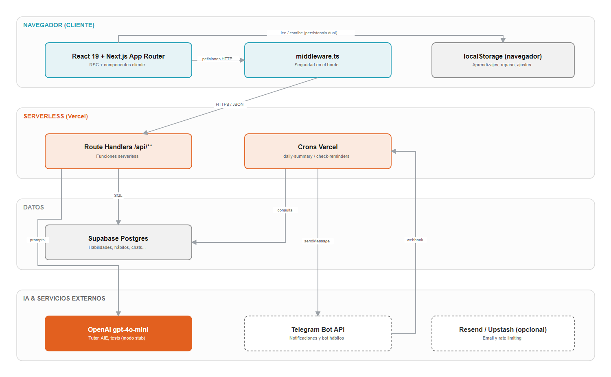
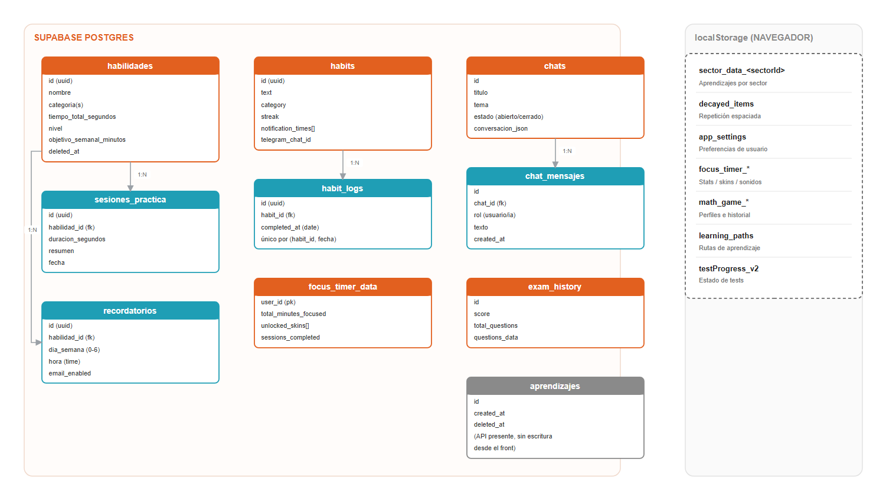
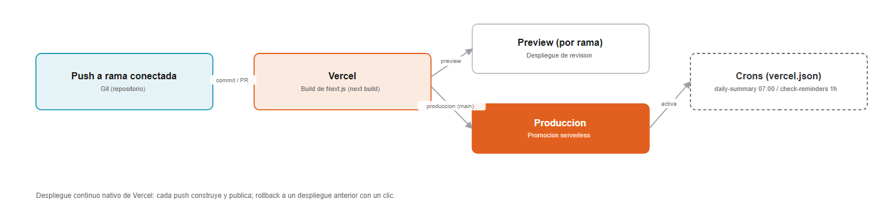

## 1. Resumen Ejecutivo

La App de Aprendizaje Soul IA (nombre comercial interno "Aprende", según el manifest y la metadata de la aplicación) es una aplicación web personal de aprendizaje construida con Next.js 16 (App Router) y React 19. Su propósito es que una persona aprenda cualquier tema conversando con un tutor de inteligencia artificial, guarde lo aprendido en forma de "aprendizajes" organizados por sectores temáticos, y los repase periódicamente mediante un sistema de repetición espaciada y tests semanales.

Técnicamente es una aplicación full-stack ligera de un solo usuario: el frontend (React Server Components + componentes de cliente) y el backend (Route Handlers de Next.js, ejecutados como funciones serverless en Vercel) viven en el mismo proyecto. La persistencia es híbrida: parte del estado se guarda en el navegador (localStorage) y parte en una base de datos Postgres gestionada por Supabase. El motor de IA es OpenAI (modelo gpt-4o-mini) con un modo de simulación ("stub") que permite operar sin clave de API. La aplicación se complementa con notificaciones por Telegram y recordatorios por email, ambos disparados por tareas programadas (crons).

Además del tutor, la aplicación incorpora un conjunto de módulos de productividad y gamificación: seguimiento de habilidades con sesiones de práctica, un gestor de hábitos integrado con un bot de Telegram, un temporizador de concentración (Focus Timer) con coleccionables, juegos matemáticos, rutas de aprendizaje y un dashboard de progreso. Está diseñada como PWA instalable, orientada principalmente a uso móvil.

## 2. Objetivos del Sistema

### 2.1 Objetivos Principales

- Facilitar el aprendizaje conversacional: permitir que el usuario plantee cualquier duda a un tutor IA y reciba explicaciones claras, adaptadas a su nivel de comprensión detectado.
- Consolidar el conocimiento: convertir cada conversación útil en un "aprendizaje" guardado, con título, resumen, etiquetas y sector temático.
- Asegurar el repaso: aplicar repetición espaciada y tests semanales para que lo aprendido no se olvide.
- Construir hábitos de estudio: integrar seguimiento de habilidades, hábitos diarios y un temporizador de concentración para sostener la práctica en el tiempo.
- Mantener la motivación: usar gamificación (rachas, niveles, coleccionables, logros) para reforzar la constancia.

### 2.2 Objetivos Secundarios

- Disponibilidad sin fricción: funcionar como PWA instalable en el móvil, con arranque rápido y experiencia offline parcial gracias al estado en localStorage.
- Degradación elegante: seguir siendo usable aunque la base de datos o la clave de OpenAI no estén disponibles (cliente "noop" de Supabase y modo "stub" de IA).
- Coste operativo bajo: apoyarse en niveles gratuitos (Vercel Hobby, Supabase free, OpenAI por uso) y en crons de baja frecuencia.
- Seguridad razonable para un solo usuario: cabeceras de seguridad estrictas, validación de entradas, rate limiting y verificación de secretos en endpoints sensibles (crons, webhook de Telegram).
- Mantenibilidad: organización por dominios (features), tipado compartido y un cliente de API centralizado.

## 3. Funcionalidades Principales

### 3.1 Tutor IA y Chat de Aprendizaje

El corazón de la aplicación. El usuario conversa con un tutor IA en la pantalla de Aprender. El motor de chat (`/api/chat`) usa OpenAI gpt-4o-mini con un prompt de sistema adaptativo.

El sistema incorpora un módulo de Evaluación Implícita (AIE, en `lib/aie/`): antes de responder, analiza el último mensaje del usuario para clasificar su nivel de comprensión (`low`, `medium`, `high`), detectar posibles lagunas o ideas equivocadas, y estimar el sentimiento (confuso, neutral, confiado). Con ese análisis genera instrucciones adaptativas para el tutor e, intercaladamente, inserta mini-evaluaciones.

Permite:

- Conversar con el tutor sobre cualquier tema, con respuestas en Markdown.
- Ajustar el nivel de detalle de las respuestas (selector de verbosidad: concisa, normal, detallada).
- Recibir recomendaciones automáticas de temas y subtemas relacionados al final de la conversación (`/api/recommendations`).
- Generar un título automático para el chat (`/api/chat/title`).
- Guardar el historial de conversaciones (sidebar de chats) y reabrirlos.
- Entrada por voz mediante reconocimiento de voz del navegador (laboratorio de voz / `react-speech-recognition`).

Casos de uso típicos:

- El usuario pregunta cómo funciona el interés compuesto y el tutor lo explica con ejemplos simples.
- Tras varias preguntas, el sistema detecta nivel "alto" y profundiza con matices avanzados.
- Al terminar, la app sugiere subtemas relacionados para seguir explorando.

### 3.2 Aprendizajes y Sectores

Cada conversación valiosa puede transformarse en un "aprendizaje". Al pulsar "Guardar aprendizaje", la app genera con IA un borrador (`/api/aprender` en modo generación) con título, resumen, etiquetas y sector sugerido, que el usuario revisa antes de confirmar.

Los aprendizajes se organizan en nueve sectores temáticos fijos (definidos en `shared/constants/sectores.ts`): Salud, Naturaleza, Física, Matemáticas, Tecnología, Historia, Artes, Economía y Sociedad/Psicología. Algunos sectores se desbloquean por progreso (modal de desbloqueo).

Permite:

- Generar un resumen estructurado de la conversación con IA antes de guardar.
- Clasificar el aprendizaje en uno o varios sectores sugeridos.
- Marcar aprendizajes como favoritos y añadir notas personales.
- Listar y filtrar los aprendizajes por sector ("Mis Aprendizajes").
- Ver una mini-línea de tiempo de la actividad de aprendizaje.

Nota sobre persistencia (hallazgo verificado en la auditoría del proyecto): el flujo real de guardado de aprendizajes escribe en localStorage del navegador (clave `sector_data_<sectorId>`), no en la base de datos. Existe una API Supabase paralela para aprendizajes (`/api/aprender/save`, `/api/aprendizajes`, papelera y restore) que actualmente no tiene consumidor en el frontend. La reconciliación de este modelo dual está documentada como decisión de producto pendiente (ver sección 12).

Casos de uso típicos:

- El usuario guarda lo aprendido sobre fotosíntesis en el sector Naturaleza.
- Revisa más tarde su lista de aprendizajes filtrando por el sector Tecnología.
- Marca como favorito un resumen especialmente útil para repasarlo a menudo.

### 3.3 Repaso y Tests Semanales

Sistema de consolidación basado en repetición espaciada. Los ítems pendientes de repaso se gestionan en localStorage (`decayed_items`), y la app ofrece un test semanal generado a partir de los aprendizajes recientes.

Permite:

- Generar un test semanal de preguntas (`/api/repaso`) basado en aprendizajes recientes.
- Generar preguntas de evaluación sobre un contenido concreto ("Ponme a prueba", `/api/test-me`).
- Ejecutar el test con una pantalla de preparación y un modal de detalle.
- Guardar el historial de exámenes realizados (puntuación, número de preguntas, datos de las preguntas) en la tabla `exam_history` de Supabase (`/api/repaso/historial`).
- Consultar el historial de exámenes anteriores.

Casos de uso típicos:

- El domingo el usuario lanza su test semanal desde la home y repasa lo aprendido.
- Tras leer un resumen, pulsa "Ponme a prueba" para autoevaluarse.
- Consulta su evolución revisando puntuaciones de tests pasados.

### 3.4 Habilidades y Sesiones de Práctica

Módulo para registrar habilidades que el usuario está desarrollando (por ejemplo, tocar la guitarra o programar) y acumular horas de práctica. Persiste en Supabase (tablas `habilidades` y `sesiones_practica`).

Permite:

- Crear una habilidad con nombre, categorías, descripción, experiencia previa y objetivo semanal en minutos.
- Calcular automáticamente un nivel (de "novato" en adelante) en función del tiempo total acumulado.
- Generar una guía de aprendizaje con IA para la habilidad (`/api/habilidades/[id]/generar-guia`).
- Registrar sesiones de práctica con duración y resumen (`/api/habilidades/[id]/sesiones`), que actualizan el tiempo total y el nivel.
- Configurar recordatorios de práctica (día de la semana y hora) que disparan emails.
- Soft-delete con papelera y restauración (`/api/habilidades/trash`, `/api/habilidades/[id]/restore`).
- Ver gráficos de progreso, estadísticas y logros (Achievements).

Casos de uso típicos:

- El usuario da de alta "Inglés" con 50 horas previas; la app calcula su nivel inicial.
- Registra una sesión de 30 minutos tras practicar; sube el tiempo total y, llegado el umbral, el nivel.
- Programa un recordatorio los martes a las 19:00 y recibe un email a esa hora.

### 3.5 Hábitos y Bot de Telegram

Gestor de hábitos diarios con seguimiento de rachas, integrado con un bot de Telegram. Persiste en Supabase (tablas `habits` y `habit_logs`).

Permite:

- Crear hábitos con texto, categoría y una o varias horas de notificación.
- Marcar un hábito como completado por día (registro idempotente en `habit_logs`, único por hábito y fecha).
- Llevar la racha (streak) de cada hábito.
- Vincular un chat de Telegram al conjunto de hábitos mediante el `telegram_chat_id`.
- Recibir cada mañana un resumen de objetivos por Telegram (cron diario).
- Interactuar con el bot por comandos y botones: `/start`, `/summary` (resumen del día), `/done` (marcar un hábito), con teclados en línea para completar tareas desde el chat.

Casos de uso típicos:

- A las 7:00 el usuario recibe en Telegram la lista de hábitos del día.
- Desde el propio chat pulsa el botón de un hábito y queda marcado como completado, con su racha actualizada.
- Pide `/summary` a media tarde para ver qué le falta por hacer.

### 3.6 Focus Timer (Concentración) y Gamificación

Temporizador de concentración tipo Pomodoro con capa de gamificación. La configuración y estadísticas viven principalmente en localStorage (claves `focus_timer_*`); existe además una tabla `focus_timer_data` en Supabase prevista para persistir progreso y coleccionables.

Permite:

- Iniciar sesiones de concentración con tiempos predefinidos o personalizados.
- Visualizar animaciones de progreso (taza de café, batería, cohete, bosque, montaña) seleccionables.
- Desbloquear "skins" y coleccionables según los minutos acumulados.
- Gestionar una lista de tareas (todos) y objetivos (goals) asociados a las sesiones.
- Reproducir sonidos ambientales y efectos (biblioteca Tone.js).
- Integrar el seguimiento de hábitos dentro del propio timer (HabitTracker, notificaciones de hábitos).

Casos de uso típicos:

- El usuario arranca una sesión de 25 minutos con la animación del cohete y un sonido de fondo.
- Al completar varias sesiones desbloquea una nueva skin.
- Marca sus tareas pendientes desde el panel del timer.

### 3.7 Juegos Matemáticos

Mini-juego de cálculo mental para practicar operaciones, con perfiles de jugador y estadísticas. Persiste en localStorage (`math_game_*`).

Permite:

- Jugar en modos cronometrado, libre o "inteligente" (dificultad adaptativa).
- Practicar distintas operaciones y niveles de dificultad.
- Mantener perfiles de jugador (por ejemplo, "En serio" y "Por diversión").
- Guardar estadísticas e historial de partidas.

Casos de uso típicos:

- El usuario juega una ronda cronometrada de sumas y restas.
- Cambia al modo inteligente para que la dificultad se ajuste a sus aciertos.

### 3.8 Rutas de Aprendizaje y Mapa

Permite generar y seguir rutas de aprendizaje (secuencias de temas) y visualizar el progreso en un mapa. Persiste en localStorage (`learning_paths`).

Permite:

- Generar rutas de aprendizaje a partir de un objetivo (pathGenerator).
- Consultar el detalle de cada ruta y su avance (PathDetailModal).
- Visualizar sectores y progreso en la pantalla de Mapa.

### 3.9 Funcionalidades Transversales

- Internacionalización (i18n): soporte de español e inglés con diccionarios propios (`shared/locales/es.ts`, `en.ts`) y un hook de traducción; el español es el idioma por defecto.
- Modo oscuro: alternable desde ajustes, aplicado antes de la hidratación para evitar parpadeos.
- Preferencias de usuario: idioma, modo de chat, formato de fecha, meta de racha y meta anual, guardadas en localStorage (`app_settings`).
- Salud del sistema: endpoint `/api/health` que verifica servidor y Supabase y sirve para monitorización externa.
- Degradación elegante: cliente Supabase "noop" cuando faltan variables de entorno, y modo "stub" de IA cuando falta la clave de OpenAI, de modo que la UI no se rompe.
- Validación y manejo de errores homogéneo: utilidades de validación (UUID, enteros, strings acotados), respuestas estándar `{ success, error, message }` y errores saneados sin filtrar detalles internos.
- Rate limiting: limitador con backend en memoria por defecto y soporte opcional de Upstash Redis.
- PWA: manifest con accesos directos (Tutor IA, Mis aprendizajes, Focus Timer), instalable y orientada a móvil.

## 4. Arquitectura Técnica

### 4.1 Tecnologías Utilizadas

Verificado en `package.json`, configs y código fuente:

- Next.js 16 (App Router) con React 19 y React DOM 19.
- TypeScript 5 (modo `strict: false`), con soporte de JavaScript (`allowJs`).
- Tailwind CSS v4 (con `@tailwindcss/postcss` y `tw-animate-css`).
- shadcn/ui (estilo "new-york", base de color slate) e iconos Lucide React.
- Framer Motion para animaciones.
- Recharts para gráficos (progreso, dashboards).
- React Markdown para renderizar respuestas del tutor.
- date-fns para fechas; clsx, tailwind-merge y class-variance-authority para estilos.
- Supabase JS (`@supabase/supabase-js`) como cliente de base de datos y autenticación.
- OpenAI (SDK `openai`, modelo gpt-4o-mini) para el tutor, análisis AIE, resúmenes y generación de tests.
- Tone.js para audio y `react-speech-recognition` para entrada de voz.
- Playwright como dependencia de testing E2E (con un script de auditoría visual móvil en `scripts/`).
- ESLint 9 con `eslint-config-next`.

Servicios externos: Vercel (hosting y crons), Supabase (Postgres + Auth), OpenAI (IA), Telegram Bot API (notificaciones y bot de hábitos) y, opcionalmente, Resend (envío de emails) y Upstash Redis (rate limiting distribuido).

### 4.2 Patrón de Arquitectura

Aplicación full-stack monolítica sobre Next.js App Router, desplegada en modo serverless:

- Frontend: mezcla de React Server Components y componentes de cliente (`"use client"`). Estado global ligero mediante un contexto de aplicación (`AppContext`) que gestiona ajustes, i18n y el test semanal.
- Backend: Route Handlers en `app/api/**` que se ejecutan como funciones serverless (varios declaran `runtime = 'nodejs'` y `dynamic = 'force-dynamic'`). No hay servidor Express ni proceso de larga vida.
- Organización por dominios: la lógica de negocio del cliente se agrupa en `features/<dominio>/` (chat, aprendizajes, habilidades, focus-timer, juegos, rutas, stats, etc.), con utilidades y tipos compartidos en `shared/` y `lib/`.
- Persistencia dual: localStorage en el cliente para dominios de uso personal inmediato (aprendizajes, repaso, focus timer, juegos, rutas, ajustes) y Supabase Postgres para dominios que requieren consultas del servidor o integración con crons/bot (habilidades, sesiones, hábitos, recordatorios, chats persistidos, historial de exámenes).
- Seguridad en el borde: un `middleware.ts` global aplica cabeceras de seguridad, bloquea patrones sospechosos (path traversal, XSS, CRLF, bytes nulos) y acota el tamaño del cuerpo de las peticiones a la API.

### 4.3 Componentes de la Arquitectura

- Capa de páginas (rutas de la app): home, aprender, aprendizajes, habilidades, focus-timer, juegos-matemáticos, lab-voz, login, mapa, progreso, repaso, rutas (ver sección 5).
- Capa de API (Route Handlers): dominios de aprendizaje, chat, tests/repaso, habilidades, hábitos, recordatorios, estadísticas, notificaciones (Telegram), salud y crons.
- Clientes de datos (`lib/`):
  - `supabase.ts`: cliente público con anon key y un cliente "noop" de respaldo si faltan variables.
  - `supabaseRoute.ts`: cliente por petición que propaga el JWT del usuario si viene en la cabecera Authorization.
  - `supabaseAnonClient.ts`: clientes cacheados anon y admin (service-role) para contextos de confianza (crons, webhook).
- Capa de IA (`lib/openai.ts`, `lib/aie/`): cliente OpenAI singleton con modo stub, y el motor de Evaluación Implícita (analyzer, adapter, types).
- Integraciones (`lib/`): `telegram-server.ts` (envío de mensajes), `email-service.ts` (Resend con stub), `rateLimit.ts` (memoria/Upstash), `validate.ts` (validación y comparación timing-safe).
- Tareas programadas (crons): resumen diario por Telegram (`/api/cron/daily-summary`) y comprobación horaria de recordatorios por email (`/api/cron/check-reminders`), definidas en `vercel.json`.
- Bot de Telegram: webhook (`/api/notify/telegram/webhook`) y configuración del webhook (`/api/notify/telegram/setup`).

### 4.4 Modelo de Datos

El sistema combina dos almacenes. En Supabase Postgres residen las entidades del lado servidor; en localStorage del navegador, los dominios de uso personal. El siguiente diagrama resume ambos almacenes y sus relaciones (deducido de las migraciones SQL en `docs/` y del código de las rutas).

Tablas principales de Supabase y campos relevantes (verificado en SQL y rutas):

| Tabla | Campos clave | Notas |
| --- | --- | --- |
| habilidades | id (uuid), nombre, categoria(s), descripcion, guia_generada, tiempo_total_segundos, nivel, experiencia_previa, objetivo_semanal_minutos, deleted_at | Soft-delete; trigger de updated_at; nivel recalculado por tiempo |
| sesiones_practica | id (uuid), habilidad_id (fk), duracion_segundos, resumen, fecha | Relación 1:N con habilidades; embebida como `sesiones_practica` |
| recordatorios | id (uuid), habilidad_id (fk), dia_semana (0-6), hora (time), email_enabled, active | Consultada por el cron horario |
| habits | id (uuid), text, category, streak, with_notification, notification_times (array), custom_message, telegram_chat_id | Vinculación al bot por telegram_chat_id |
| habit_logs | id (uuid), habit_id (fk), completed_at (date) | Único por (habit_id, completed_at): idempotencia |
| focus_timer_data | user_id (pk), total_minutes_focused, unlocked_skins (array), current_skin, sessions_completed | Coleccionables del Focus Timer |
| chats | id, titulo, tema, estado (abierto/cerrado), conversacion_json, created_at | Historial de conversaciones del tutor |
| chat_mensajes | id, chat_id (fk), rol (usuario/ia), texto, created_at | Mensajes de cada chat |
| aprendizajes | id, created_at, deleted_at | API completa presente; sin consumidor de escritura en el frontend |
| exam_history | id, score, total_questions, questions_data, created_at | Historial de tests/repasos |

Dominios persistidos en localStorage (cliente):

| Clave | Contenido |
| --- | --- |
| sector_data_<sectorId> | Aprendizajes por sector (título, resumen, contenido, tags, favorito, nota) |
| decayed_items | Ítems pendientes de repaso (repetición espaciada) |
| app_settings | Preferencias (idioma, modo chat, formato fecha, metas) |
| focus_timer_* | Estadísticas, todos, objetivos, skins y sonidos del Focus Timer |
| math_game_* | Perfiles, estadísticas e historial de los juegos matemáticos |
| learning_paths | Rutas de aprendizaje |
| testProgress_v2, repaso_done_<YYYYMM>, learnings_view_mode | Estado de tests y vista |

Seguridad de datos en Supabase: las tablas tienen RLS habilitado con políticas de "acceso público" (using true / with check true) coherentes con el diseño de un solo usuario sin login estricto. Los índices de rendimiento están definidos en `docs/migrations/2026_05_indexes.sql` (índices parciales para filas vivas frente a papelera, índices por relaciones y por chat).

## 5. Pantallas y Flujos

Al ser una aplicación frontend-pesada (Next.js App Router), la sección de endpoints se complementa con el mapa de pantallas. Todas las rutas devolvían 200 en el smoke test de la auditoría.

### 5.1 Rutas de la Aplicación (Pantallas)

| Ruta | Pantalla | Qué hace |
| --- | --- | --- |
| `/` | Home | Cabecera rotativa, acceso al tutor, sectores con progreso, lanzar test semanal, racha de aprendizaje |
| `/aprender` | Tutor IA | Chat con el tutor, sidebar de chats, guardar aprendizaje, recomendaciones, entrada por voz |
| `/aprendizajes` | Mis Aprendizajes | Lista de aprendizajes guardados, favoritos, filtros, papelera (UI) |
| `/aprendizajes/[sectorId]` | Aprendizajes por sector | Aprendizajes de un sector concreto |
| `/habilidades` | Habilidades | Lista de habilidades con estado de error/Reintentar; alta de habilidad |
| `/habilidades/[id]` | Detalle de habilidad | Práctica, guía, gráficos, sesiones, recordatorios, logros |
| `/focus-timer` | Focus Timer | Temporizador, animaciones, coleccionables, todos, hábitos |
| `/juegos-matematicos` | Juegos Matemáticos | Cálculo mental con perfiles y estadísticas |
| `/lab-voz` | Laboratorio de Voz | Pruebas de reconocimiento de voz y TTS |
| `/login` | Acceso | Enlace mágico por email (Supabase Auth) |
| `/mapa` | Mapa | Visualización de sectores y progreso |
| `/progreso` | Progreso | Dashboard: racha, heatmap de actividad, estadísticas por habilidad |
| `/repaso` | Repaso / Test | Ejecución del test semanal y repaso espaciado |
| `/repaso/historial` | Historial de Repaso | Tests realizados con sus puntuaciones |
| `/rutas` | Rutas de Aprendizaje | Generación y seguimiento de rutas |

### 5.2 API Routes (Route Handlers)

Agrupadas por dominio. Todas viven en `app/api/**`.

Aprendizaje:

| Método | Ruta | Descripción |
| --- | --- | --- |
| POST | /api/aprender | Wrapper de compatibilidad: delega en generate (borrador IA) o save (guardar) |
| POST | /api/aprender/generate | Genera resumen, título, tags y sector con IA |
| POST | /api/aprender/save | Guarda aprendizaje en Supabase (sin consumidor en el frontend actual) |
| POST | /api/aprender/edit | Edita un resumen con IA |
| GET | /api/aprendizajes | Lista aprendizajes, agregados y progreso (Supabase) |
| GET/POST | /api/aprendizajes/trash | Papelera de aprendizajes |
| POST | /api/aprendizajes/[id]/restore | Restaura un aprendizaje |
| GET | /api/sectores | Lista de sectores temáticos |

Chat:

| Método | Ruta | Descripción |
| --- | --- | --- |
| POST | /api/chat | Motor del tutor con análisis AIE (OpenAI o stub) |
| POST | /api/chat/title | Genera título automático del chat |
| GET/POST | /api/chats | Lista y crea chats guardados |
| GET/DELETE | /api/chats/[id] | Obtiene o elimina un chat |
| POST | /api/chats/[id]/messages | Inserta mensaje, genera respuesta IA y la persiste |
| POST | /api/chats/[id]/close | Cierra un chat (valida id; opcionalmente vincula aprendizaje) |
| POST | /api/recommendations | Temas y subtemas relacionados |

Tests y repaso:

| Método | Ruta | Descripción |
| --- | --- | --- |
| GET | /api/repaso | Genera preguntas de repaso de aprendizajes recientes |
| POST | /api/test-me | Genera 3 preguntas de evaluación sobre un contenido |
| GET/POST | /api/repaso/historial | Lista y guarda historial de exámenes (exam_history) |

Habilidades y recordatorios:

| Método | Ruta | Descripción |
| --- | --- | --- |
| GET/POST | /api/habilidades | Lista y crea habilidades |
| GET/PATCH/DELETE | /api/habilidades/[id] | Obtiene, actualiza o borra (soft) una habilidad |
| POST | /api/habilidades/[id]/generar-guia | Genera guía de aprendizaje con IA |
| POST | /api/habilidades/[id]/sesiones | Registra sesión de práctica (actualiza tiempo y nivel) |
| POST | /api/habilidades/[id]/restore | Restaura una habilidad |
| GET/POST | /api/habilidades/trash | Papelera de habilidades |
| GET/POST | /api/recordatorios | Lista y crea recordatorios |
| GET/PATCH/DELETE | /api/recordatorios/[id] | Gestiona un recordatorio |

Hábitos:

| Método | Ruta | Descripción |
| --- | --- | --- |
| GET/POST | /api/habits | Lista y crea hábitos |
| GET/PATCH/DELETE | /api/habits/[id] | Gestiona un hábito |
| POST | /api/habits/[id]/log | Marca un hábito como completado (idempotente) |

Estadísticas, notificaciones, salud y juegos:

| Método | Ruta | Descripción |
| --- | --- | --- |
| GET | /api/stats/activity | Log de actividad (aprendizaje + práctica) y stats por habilidad |
| POST | /api/notify/telegram | Envío de mensaje por Telegram |
| POST | /api/notify/telegram/setup | Configura el webhook del bot |
| POST | /api/notify/telegram/webhook | Recibe updates del bot (comandos y botones) |
| GET | /api/sorpresas | Chiste y curiosidad por sector (datos estáticos) |
| GET | /api/health | Estado del servicio (servidor + Supabase) |
| GET | /api/cron/daily-summary | Cron diario: resumen de hábitos por Telegram |
| GET | /api/cron/check-reminders | Cron horario: recordatorios de práctica por email |

### 5.3 Flujos Clave

- Aprender y guardar: el usuario conversa en `/aprender` (POST `/api/chat`), pulsa guardar, la app genera un borrador (POST `/api/aprender` en modo generación), lo revisa en un modal y al confirmar se persiste en localStorage (`sector_data_*`).
- Practicar una habilidad: alta en `/habilidades` (POST `/api/habilidades`), registro de sesión (POST `/api/habilidades/[id]/sesiones`) que sube tiempo y nivel; opcionalmente, recordatorio que dispara email vía cron.
- Hábitos por Telegram: cron diario envía el resumen; el usuario completa hábitos desde el chat (webhook), registrando `habit_logs` y subiendo la racha.

## 6. Seguridad

### 6.1 Autenticación y Autorización

- Autenticación: Supabase Auth mediante enlace mágico por email (OTP) en `/login` (`supabase.auth.signInWithOtp`). La aplicación está diseñada para un solo usuario y opera en la práctica sin login estricto.
- Autorización en base de datos: RLS habilitado en todas las tablas, con políticas de acceso público (using true) coherentes con el modelo de un solo usuario. Para operaciones de confianza (crons, webhook) se usa el cliente admin con service-role, que omite RLS.
- Endpoints sensibles: los crons exigen un secreto (`CRON_SECRET`) verificado con comparación timing-safe (Bearer). El webhook de Telegram exige el secreto `TELEGRAM_WEBHOOK_SECRET` (cabecera `X-Telegram-Bot-Api-Secret-Token`), también comparado en tiempo constante, y rechaza todo si no está configurado.
- Propiedad de datos en el bot: antes de marcar un hábito como completado, se verifica que pertenezca al `telegram_chat_id` que lo solicita.

### 6.2 Protección de Datos

- Cifrado en tránsito: HTTPS forzado (HSTS con preload) y `upgrade-insecure-requests` en la CSP.
- Soft-delete: habilidades y aprendizajes usan `deleted_at` y papelera con restauración, manteniendo el histórico.
- Errores saneados: las rutas registran el detalle en logs del servidor pero devuelven mensajes genéricos (`DB_ERROR`, `INTERNAL_ERROR`) sin filtrar información de la base de datos.
- Cabeceras de seguridad: `next.config.ts` aplica una CSP estricta (orígenes acotados a Supabase, OpenAI y Telegram), `X-Frame-Options: SAMEORIGIN`, `X-Content-Type-Options: nosniff`, `Referrer-Policy`, `Permissions-Policy` (cámara, micrófono y geolocalización deshabilitados) y `Strict-Transport-Security`.

### 6.3 Buenas Prácticas

- Defensa en el borde (`middleware.ts`): decodificación defensiva de la URL (hasta 5 iteraciones), bloqueo de patrones sospechosos (path traversal, `<script`, `javascript:`, CRLF, bytes nulos), exigencia de content-type JSON o multipart en POST/PUT/PATCH a la API y límite de cuerpo a 1 MB.
- Validación de entradas (`lib/validate.ts`): UUID y IDs de ruta, enteros y números acotados, strings con longitud máxima, escape de comodines LIKE, comparación timing-safe (`safeEqual`, `verifyBearer`).
- Sanitización de prompts: el contexto y mensajes del tutor se acotan y limpian de saltos de línea y caracteres de control antes de interpolarse en los prompts de OpenAI.
- Rate limiting (`lib/rateLimit.ts`): límites por IP en endpoints que llaman a IA o al bot (por ejemplo, 30 req/min en chat; 60 req/min en el webhook), con backend en memoria y soporte opcional de Upstash Redis (fail-open ante fallo de Redis).
- Gestión de secretos: todas las claves (Supabase, OpenAI, Telegram, Resend, Upstash, CRON_SECRET) se leen de variables de entorno; nunca se exponen al cliente salvo las explícitamente públicas (`NEXT_PUBLIC_*`).

## 7. Entorno de Desarrollo Local

- Requisitos: Node.js (tipos `@types/node` 20) y npm.
- Instalación: `npm install`.
- Servidor de desarrollo: `npm run dev` (Next.js dev), accesible en `http://localhost:3000`.
- Build de producción: `npm run build`; arranque: `npm start`.
- Linting: `npm run lint` (ESLint 9 con `eslint-config-next`).
- Typecheck: `npx tsc --noEmit` (configuración con `strict: false`).
- Tests E2E: Playwright instalado; en `scripts/` hay una auditoría visual móvil (`mobile-audit.mjs`).
- Variables de entorno (nombres, en `.env.local`, sin valores):
  - `NEXT_PUBLIC_SUPABASE_URL`, `NEXT_PUBLIC_SUPABASE_ANON_KEY`: cliente Supabase (públicas).
  - `SUPABASE_SERVICE_ROLE_KEY`: cliente admin para crons y webhook (secreta).
  - `DISABLE_SUPABASE`: fuerza el cliente "noop" (valor `1`).
  - `OPENAI_API_KEY`, `USE_STUB_AI`: motor de IA y modo simulación.
  - `TELEGRAM_BOT_TOKEN`, `TELEGRAM_WEBHOOK_SECRET`: bot de hábitos.
  - `CRON_SECRET`: protección de los endpoints de cron.
  - `RESEND_API_KEY`, `RESEND_FROM`, `REMINDER_EMAIL_TO`: envío de recordatorios por email.
  - `UPSTASH_REDIS_REST_URL`, `UPSTASH_REDIS_REST_TOKEN`: rate limiting distribuido (opcional).
- Inicialización de base de datos: ejecutar los scripts SQL de `docs/` en el editor SQL de Supabase (habilidades, hábitos, recordatorios, focus timer, objetivos, índices).
- Comportamiento sin servicios: si faltan las variables de Supabase u OpenAI, la app no se rompe (cliente noop y modo stub); se pueden recorrer las pantallas con datos locales.

## 8. Pipelines CI/CD

- Despliegue: el proyecto está orientado a Vercel (README y `vercel.json`). Vercel construye y publica automáticamente en cada push a la rama conectada, generando previews por rama y promoción a producción.
- Tareas programadas: `vercel.json` define dos crons:
  - `/api/cron/daily-summary` a las 07:00 (resumen diario de hábitos por Telegram).
  - `/api/cron/check-reminders` cada hora (recordatorios de práctica por email).
- Verificaciones disponibles: typecheck (`tsc --noEmit`), build (`next build`), lint (`eslint`) y auditoría visual móvil con Playwright. En el repositorio hay scripts de despliegue seguro (`scripts/deploy-secure.ps1` y `.sh`).
- Estado de calidad (según la auditoría del proyecto): typecheck y build pasan limpios; el lint presenta avisos y errores estilísticos preexistentes que no bloquean el build.

Nota: no se ha verificado en el repositorio la existencia de workflows de GitHub Actions; el flujo de integración y despliegue se apoya en la integración nativa de Vercel.

## 9. Ambientes

| Ambiente | Propósito | Configuración |
| --- | --- | --- |
| Local (desarrollo) | Desarrollo y pruebas en la máquina del desarrollador | `.env.local`; Supabase y OpenAI opcionales (noop/stub); puerto 3000 |
| Preview (Vercel) | Despliegues por rama para revisión | Variables de entorno de preview en Vercel |
| Producción (Vercel) | Aplicación pública para el usuario | Variables de producción; crons activos; webhook de Telegram configurado |

Cada ambiente define sus propias variables (Supabase, OpenAI, Telegram, Resend, CRON_SECRET). Supabase es un proyecto único compartido salvo que se configure uno por ambiente; conviene aislar claves entre preview y producción.

## 10. Beneficios para el Negocio

### 10.1 Operativos

- Aprendizaje autónomo: el usuario resuelve dudas y consolida conocimiento sin depender de terceros, a su ritmo.
- Constancia sostenida: hábitos, recordatorios y notificaciones por Telegram mantienen la rutina sin esfuerzo de gestión.
- Todo en un sitio: tutor, notas, repaso, habilidades, hábitos y concentración conviven en una única app instalable.

### 10.2 Estratégicos

- Personalización pedagógica: el motor de Evaluación Implícita adapta el tutor al nivel real del usuario, mejorando la eficacia del aprendizaje.
- Retención del conocimiento: la repetición espaciada y los tests semanales combaten el olvido, maximizando el retorno del tiempo invertido.
- Base extensible: la organización por dominios permite añadir nuevos módulos (rutas, juegos, etc.) sin reescribir el núcleo.

### 10.3 Técnicos

- Coste mínimo: apoyo en niveles gratuitos (Vercel, Supabase) y pago por uso en OpenAI, con crons de baja frecuencia.
- Resiliencia: degradación elegante ante fallos de IA o base de datos; la app sigue siendo usable con estado local.
- Seguridad de partida sólida: cabeceras estrictas, validación, rate limiting y verificación de secretos en endpoints sensibles.

## 11. Casos de Uso Completos

### Caso de Uso 1: De la duda al aprendizaje guardado

1. El usuario abre `/aprender` y pregunta al tutor sobre un tema.
2. El motor de chat analiza su nivel (AIE) y responde de forma adaptada (POST `/api/chat`).
3. Tras varias respuestas, pulsa "Guardar aprendizaje".
4. La app genera un borrador con título, resumen, etiquetas y sector sugerido (POST `/api/aprender`).
5. El usuario revisa y confirma; el aprendizaje se guarda en localStorage bajo su sector.
6. Más tarde lo encuentra en `/aprendizajes` y lo marca como favorito.

### Caso de Uso 2: Repaso semanal

1. El usuario lanza el test semanal desde la home.
2. La app genera preguntas a partir de los aprendizajes recientes (GET `/api/repaso`).
3. Realiza el test en `/repaso` con la pantalla de preparación.
4. Al terminar, la puntuación se guarda en el historial (POST `/api/repaso/historial`).
5. Consulta su evolución en `/repaso/historial`.

### Caso de Uso 3: Hábitos con bot de Telegram

1. El usuario crea hábitos y vincula su `telegram_chat_id`.
2. A las 07:00, el cron diario le envía el resumen de objetivos por Telegram.
3. Durante el día, completa hábitos pulsando los botones del chat (webhook).
4. Cada completado registra una fila idempotente en `habit_logs` y sube la racha.
5. Pide `/summary` para ver lo pendiente y lo ya hecho.

### Caso de Uso 4: Desarrollo de una habilidad

1. El usuario da de alta una habilidad con su experiencia previa (POST `/api/habilidades`).
2. La app calcula el nivel inicial según el tiempo estimado.
3. Tras practicar, registra una sesión con duración (POST `/api/habilidades/[id]/sesiones`).
4. El tiempo total y el nivel se actualizan automáticamente.
5. Programa un recordatorio semanal que dispara un email a la hora indicada.

## 12. Roadmap y Evolución Futura

Basado en `PROJECT_AUDIT_AND_IMPROVEMENTS.md`, `api_audit_full.md` y `docs/pending-dev.md` del repositorio:

- Reconciliar el modelo dual de "aprendizajes" (decisión de producto pendiente): migrar a Supabase para sincronización multi-dispositivo (opción A, requiere migración de datos y autorización) o consolidar en localStorage retirando la API muerta (opción B). Bloqueada mientras Supabase no esté accesible para verificar sin riesgo de pérdida de datos.
- Estandarizar las respuestas de la API a `ApiResponse<T>` (`{ success, data, error }`) en todas las rutas, incluida `/api/sectores` (hoy devuelve un array crudo).
- Migrar a TypeScript las rutas aún en JavaScript (`aprendizajes`, `repaso`, `sorpresas`).
- Unificar la instancia de OpenAI y la lógica de stub (ya iniciado con `lib/openai.ts`) y reorganizar rutas por dominios (learning, chat, tests, games).
- Validación de inputs con Zod y rate limiting en las rutas que aún no lo tienen.
- Mover los datos estáticos de `sorpresas` (gran tamaño) a un JSON cargado bajo demanda.
- Limpieza dedicada de lint (tipar `any`, `prefer-const`, escapar entidades) sin mezclar con cambios funcionales.
- Mejoras de accesibilidad pendientes en móvil (targets táctiles por debajo de 24 px en algunas pantallas), a abordar con verificación visual.

## 13. Soporte y Mantenimiento

### Monitoreo

- Endpoint de salud `/api/health`: devuelve 200 si servidor y Supabase están sanos, 503 en degradado; reporta latencia de Supabase y estado de OpenAI (stub o real). Apto para monitorización externa (UptimeRobot u similar) y para mantener activo el proyecto Supabase del nivel gratuito (se pausa tras inactividad).
- Logs: cada ruta registra errores en consola del servidor (visibles en los logs de Vercel) sin filtrar detalles al cliente.
- Tareas programadas: los crons reportan en su respuesta el número de elementos procesados y registran avisos en consola.

### Actualizaciones

- Despliegue continuo vía Vercel (push a la rama conectada).
- Rollback: Vercel permite revertir a un despliegue anterior con un clic.
- Migraciones de base de datos: scripts SQL en `docs/` aplicados manualmente en Supabase (idempotentes con IF NOT EXISTS donde aplica).
- Verificación previa: typecheck, build, lint y auditoría visual móvil antes de promocionar.

## 14. Conclusión

La App de Aprendizaje Soul IA es una aplicación full-stack moderna y compacta que combina un tutor IA adaptativo con un completo sistema de consolidación del conocimiento (aprendizajes por sector, repetición espaciada y tests) y una capa de productividad y gamificación (habilidades, hábitos, focus timer y juegos). Construida sobre Next.js 16 y React 19, se apoya en Supabase para la persistencia del lado servidor y en OpenAI para la inteligencia, con integraciones de Telegram y email para sostener la rutina del usuario.

Su arquitectura prioriza la robustez operativa con bajo coste: degradación elegante cuando faltan servicios externos, cabeceras de seguridad estrictas, validación de entradas, rate limiting y verificación de secretos en los puntos sensibles. La organización por dominios y el tipado compartido facilitan su evolución, y la auditoría interna del proyecto deja un mapa claro de deuda técnica y mejoras priorizadas.

El principal punto de evolución identificado es la reconciliación del modelo de persistencia dual de los aprendizajes, que hoy viven en el navegador mientras existe una API de base de datos preparada pero no conectada. Resuelto ese punto (con sincronización multi-dispositivo o consolidación local), el sistema queda como una plataforma de aprendizaje personal sólida, mantenible y lista para crecer en nuevos módulos.

## 15. Glosario de Términos

| Término | Definición |
| --- | --- |
| SPA | Single Page Application: aplicación web que carga una sola página y actualiza el contenido sin recargas completas. |
| PWA | Progressive Web App: aplicación web instalable en el dispositivo que se comporta como una app nativa (acceso directo, uso parcial sin conexión). |
| SSR | Server-Side Rendering: el HTML de la página se genera en el servidor antes de enviarlo al navegador, para una carga inicial más rápida. |
| RSC (React Server Components) | Componentes de React que se ejecutan en el servidor y no se descargan al navegador, reduciendo el código que viaja al cliente. |
| Route Handler | Función del servidor en Next.js que atiende una ruta de la API (por ejemplo, `/api/chat`) y devuelve la respuesta. |
| Serverless | Modelo de ejecución en el que el código corre en funciones bajo demanda gestionadas por el proveedor (Vercel), sin servidores propios siempre encendidos. |
| Next.js App Router | Sistema de enrutado de Next.js basado en carpetas que organiza páginas y APIs y permite mezclar componentes de servidor y de cliente. |
| Supabase | Plataforma que ofrece una base de datos Postgres gestionada junto con autenticación y APIs listas para usar. |
| RLS (Row Level Security) | Mecanismo de Postgres que aplica reglas de acceso fila a fila, controlando qué registros puede ver o modificar cada usuario. |
| localStorage | Almacén de datos del navegador que guarda información en el propio dispositivo del usuario, sin pasar por el servidor. |
| JWT / OTP | JWT: credencial firmada que identifica al usuario en cada petición. OTP: enlace o código de un solo uso enviado por email para iniciar sesión. |
| Repetición espaciada | Técnica de estudio que programa los repasos en intervalos crecientes para fijar el conocimiento y combatir el olvido. |
| AIE (Evaluación Implícita) | Módulo que analiza los mensajes del usuario para estimar su nivel de comprensión y adaptar las respuestas del tutor. |
| Stub de IA | Modo de simulación que devuelve respuestas de prueba cuando no hay clave de OpenAI, para que la app funcione sin coste. |
| Rate limiting | Límite del número de peticiones por usuario o IP en un periodo, para proteger los servicios de abuso o sobrecarga. |
| CSP (Content Security Policy) | Cabecera de seguridad que restringe desde qué orígenes puede cargar recursos la web, mitigando ataques de inyección. |
| HSTS | Cabecera que obliga al navegador a comunicarse siempre por HTTPS con el sitio, evitando conexiones inseguras. |
| Webhook | URL del servidor que un servicio externo (por ejemplo, Telegram) llama automáticamente para notificar eventos en tiempo real. |
| Cron | Tarea programada que se ejecuta de forma automática a una hora o frecuencia fijas (por ejemplo, el resumen diario de hábitos). |
| Soft-delete | Borrado lógico: el registro se marca como eliminado (`deleted_at`) en lugar de borrarse, lo que permite recuperarlo desde una papelera. |
